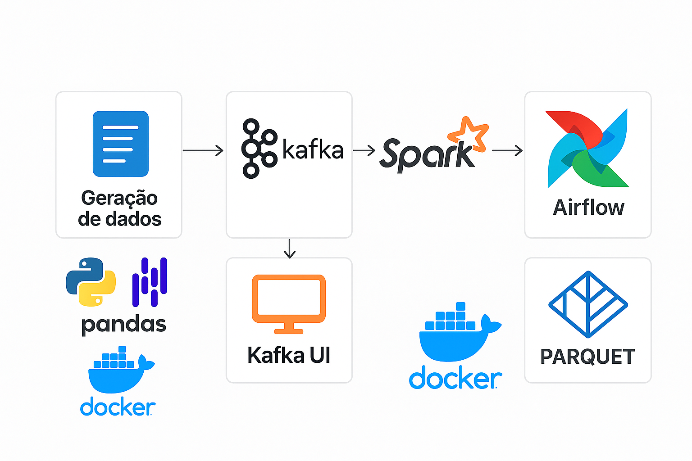

# 🚀 Projeto ELT com PySpark, Kafka e Streaming

Este projeto implementa uma arquitetura moderna de streaming de dados voltada para o processamento em tempo real de transações financeiras simuladas. Ele integra tecnologias robustas e escaláveis como **Apache Kafka**, **Apache Spark (PySpark)** e **Apache Airflow**, proporcionando uma pipeline eficiente e modular para ingestão, transformação e orquestração de dados transacionais.
New:
    Com a nova Feature os dados são persistidos em formato parquet!

## 🏗️ Arquitetura
O projeto é composto por:
- **Geração de dados**: Módulo para gerar dados simulados de clientes e transações
- **Kafka**: Middleware de mensageria para streaming de dados
- **Spark**: Engine de processamento para transformação dos dados
- **Airflow**: Orquestrador de fluxos de trabalho para automação de tarefas
 


## 📁 Estrutura do Projeto

```
.
├── README.md                         # Documentação do projeto
├── requirements.txt                  # Dependências principais
├── requirements-airflow.txt          # Dependências específicas para o Airflow
├── docker-compose.yml                # Orquestração dos serviços com Docker
├── Dockerfile                        # Container base do projeto
├── Dockerfile.airflow                # Container específico do Airflow
├── Makefile                          # Automação de comandos úteis
├── main.py                           # Script principal para execução do pipeline
├── .dockerignore
├── .gitignore
│
├── dags/                             # DAGs do Apache Airflow
├── config/                           # Arquivos de configuração
├── Data/                             # Diretório para arquivos de entrada
├── extract/                          # Scripts de extração de dados
├── transform/                        # Transformações com PySpark
├── generator/                        # Geração de dados simulados
├── kafka_module/                     # Módulos e utilitários Kafka
├── pipeline/                         # Orquestração e lógica do pipeline
├── plugins/                          # Plugins adicionais (Airflow ou outros)
├── notebooks/                        # Análises exploratórias e testes
├── utils/                            # Funções auxiliares e comuns
├── logs/                             # Logs gerados durante a execução
├── images/                           # Imagens para documentação (ex: arquitetura)
└── venv/                             # Ambiente virtual Python (local)

```

---

## 🧱 Tecnologias Utilizadas

- [Python 3.11+](https://www.python.org/) - Linguagem de programação principal
- [Apache Spark 3+ (via PySpark)](https://spark.apache.org/) - Framework de processamento distribuído
- [Apache Kafka](https://kafka.apache.org/) - Plataforma de streaming distribuído
- [Apache Airflow](https://airflow.apache.org/) - orquestração e automação de workflows. 
- [Kafka UI](https://github.com/provectuslabs/kafka-ui) - Interface visual para gerenciamento do Kafka
- [Pandas](https://pandas.pydata.org/) - Biblioteca para análise de dados
- [Faker](https://faker.readthedocs.io/) - Geração de dados sintéticos para testes
- [Docker](https://www.docker.com/) - Containerização da aplicação
- [Jupyter Base Notebook (imagem Docker)](https://hub.docker.com/r/jupyter/pyspark-notebook) - Ambiente interativo

---

## 📦 Instalação e Execução (via Docker)

### 1. Build da imagem

```bash
make build
```

### 2. Inicie os serviços e Execute o Pipeline

```bash
make start
```
### 3. Verifique os logs

## 📂 Fontes de Dados

Os dados de entrada estão localizados em `data/raw/`:

- `clientes.csv`
- `transacoes.csv`

Esses arquivos são validados antes da transformação com Spark:

- Checagem de colunas obrigatórias  
- Unicidade de chaves  
- Validação de formato de datas  

---

## 🔄 Pipeline

### 🔹 Etapa Extract (pandas)
- Valida dados brutos com `pandas`
- Verifica integridade e estrutura dos arquivos

### 🔸 Etapa Transform (PySpark)
- Cria colunas derivadas (`ano`, `mês`, `faixa_etaria`)
- Agrega dados por categoria, cidade e cliente
- Executa consultas SQL no Spark

---


## 🧰 Comandos úteis (Makefile)

```bash
make build           # Build da imagem Docker
make start           # Executa o pipeline via Docker
make lint            # Verifica estilo de código com flake8, isort
make lint-fix        # Aplica formatação com black, isort
make check-init      # Verifica arquivos __init__.py nas pastas
```

## 🌐 Webservice Kafka

O projeto agora inclui um webservice para interagir com o Kafka através de uma API REST.

### Endpoints disponíveis:

- `GET /`: Página inicial com informações sobre os endpoints
- `GET /status`: Verifica o status da conexão com o Kafka
- `GET /mensagens/{topico}`: Obtém as últimas mensagens de um tópico
- `POST /publicar/{topico}`: Publica uma mensagem em um tópico

### Executando o webservice:

```bash
# Localmente
make kafka-webservice

# Via Docker
make kafka-webservice-docker

## 🧑‍💻 Autor

---

## 📜 Licença

Este projeto está sob a licença MIT. Consulte o arquivo `LICENSE` para mais informações.
